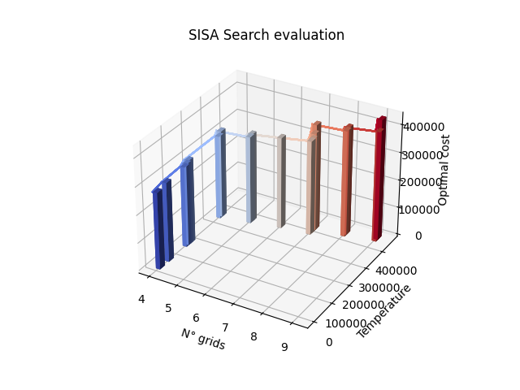

# SiSA-optimization-algorithm
Simplex algorithm integrated with simulated annehaling serch metaheuristc applied to the Cover printing problem.

[Documentation with approach explained](Project_report.pdf)

Example of rendered result:

